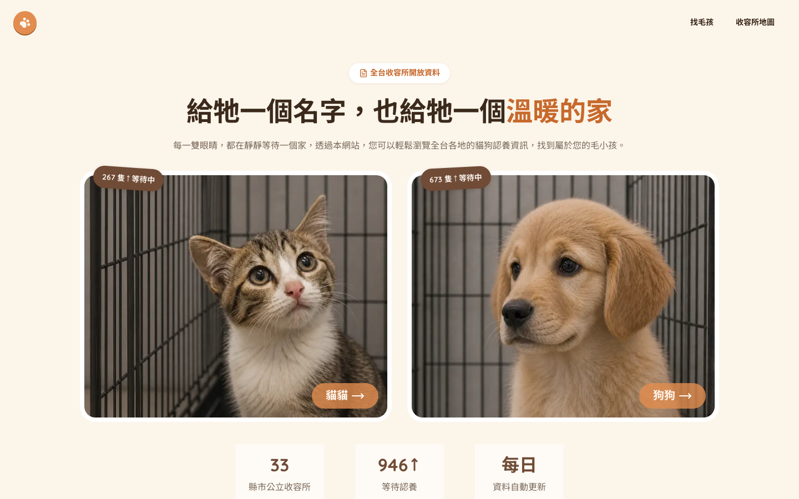
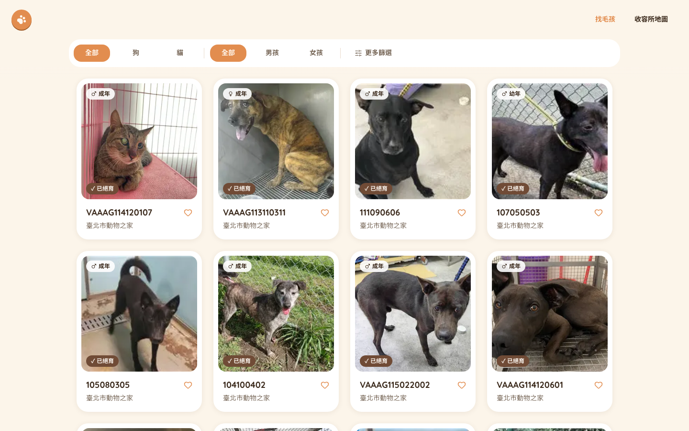
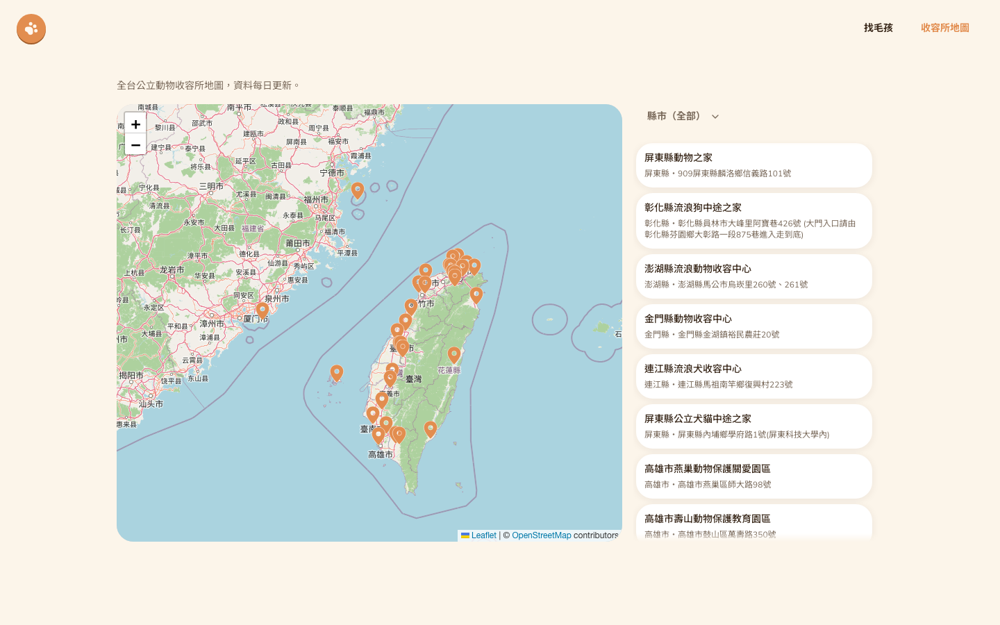

# 毛孩之家 Animal Adoption

> A Next.js 16 (App Router) front-end side project that surfaces Taiwan's official government open-data animal adoption API through a card-based browsing experience — with an API proxy/caching layer, URL-synced filters, infinite scroll, and an interactive shelter map.





**線上 Demo**：尚未部署（TODO）

---

## 專案簡介

串接農業部「動物認領養」開放資料 API，做一個資訊清楚的認養資訊網站。

## 功能

- **動物列表**（`/animals`）：種類、體型、性別、絕育狀態篩選，無限捲動載入
- **動物詳情頁**（`/animals/[id]`）：完整資料 + 收容所聯絡資訊 + Google 地圖連結
- **收容所地圖**（`/shelters`）：Leaflet 互動地圖，33 間公立收容所，可依縣市篩選、點選 pin 或清單切換詳情，手機版有底部詳情抽屜
- **首頁**：即時統計（貓／狗等待認養數、收容所縣市數）
- 篩選狀態同步在 URL query params（可分享連結、支援瀏覽器上一頁）

## 技術棧

| 分類      | 選用                                                    |
| --------- | ------------------------------------------------------- |
| 框架      | Next.js 16（App Router、React 19、Server Components）   |
| 語言      | TypeScript                                              |
| 樣式 / UI | Tailwind CSS v4、shadcn/ui（Base UI）                   |
| 資料驗證  | Zod（runtime schema 驗證）                              |
| 地圖      | Leaflet + react-leaflet + OpenStreetMap（無需 API key） |
| Lint      | ESLint                                                  |

## 架構亮點（值得一提的技術決策）

- **API 代理層而非直連**：外部 API 實測 CORS 開放，前端技術上可直接呼叫，但仍統一走 `app/api/animals` 代理——集中快取控制、篩選邏輯不暴露在 devtools、未來要換自建資料庫時前端零改動。
- **應對「非會員分頁鎖死」的架構調整**：實測發現外部 API 非會員只能拿到 `Page=1` 的資料（`$top` 上限 1000 筆），官方分頁機制對匿名存取無用。因此改為代理層一次抓滿 1000 筆做 1 小時快取，所有篩選與無限捲動的分頁位移都在程式碼裡對這份陣列做 `.filter()` + `.slice()`，讓不同篩選組合共用同一份上游快取，而不是各自打一次外部 API。
- **Runtime 資料驗證**：官方 API 欄位型別不穩定（文件寫 string、實際回傳 number）、可能缺值，用 Zod 逐筆 `safeParse`，過濾髒資料但不會因單筆壞資料丟棄整批。
- **Design token 化的設計系統**：全站配色／字體／圓角／陰影規則抽成 [DESIGN.md](DESIGN.md) 作為唯一真相來源，元件只認 shadcn 語意 token（`bg-primary` 等），換主題只需改 `globals.css` 的色值。

更完整的規劃過程與決策記錄見 [PROJECT_PLAN.md](PROJECT_PLAN.md)。

## 開發

```bash
npm install
npm run dev      # http://localhost:3000
npm run build
npm run lint
```

## 專案結構

```
app/
  page.tsx                首頁
  animals/                動物列表 + 詳情頁
  shelters/                收容所地圖頁
  api/animals/route.ts    API 代理層（快取 + 篩選 + 分頁）
components/                UI 元件（含 components/ui/ 的 shadcn primitives）
lib/                        資料抓取（animals.ts / shelters.ts）與 zod schema
```
